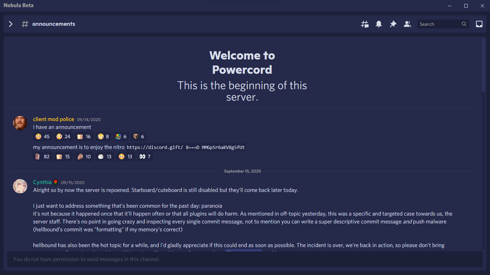
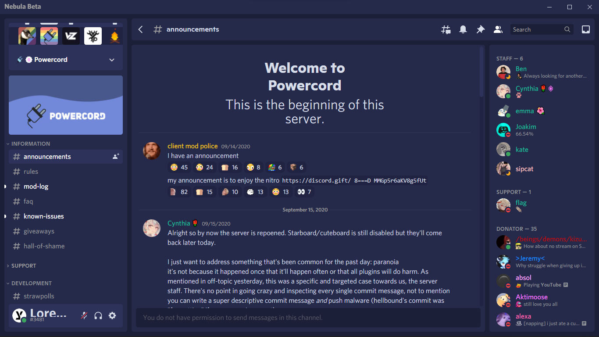

<h1 align=center> Nebula</h1> 
<h2 align=center> Round..ish, Deep Sea Blue, Consistent, Nebula!</h2>

<div style="display:flex; flex-direction: row; grid-gap: 5px;">
    
    
</div>

<h1></h1>

# Overview
### Nebula is the first theme with js (for no reason), that grabs some cool color palette and alittle neomorphism and made a baby and this thing is what showed up.
<br>

# Installation 
## Prerequisites 
### This Plugin requires the latest version of [Powercord](https://powercord.dev/installation) and [Discord Canary](https://discordia.me/en/canary)

# Plugin Installation
### For [Powercord](https://powercord.dev) users who do not have [Plugin Downloader](https://github.com/LandenStephenss/PowercordPluginDownloader) You can install the theme with the command below. 

```    
cd powercord/src/powercord/plugins && git clone https://github.com/loremly/nebula
```
### Updates
Each and every update as well as information regarding this funky commit names can be found in the repos [Changlogs](https://github.com/Loremly/Nebula/blob/main/changelog.md)
# License
### This project is licensed under the `GNU-GPL v3`. For more information check the raw [License](https://github.com/Loremly/Nebula/blob/main/LICENSE.MD)

# Support
### For support go to the [Powercord](https://discord.gg/2dp4n5qdNm) Server
